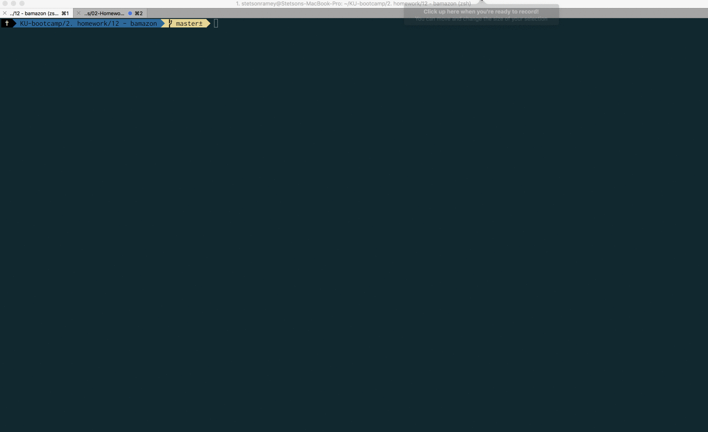

# MySQL Homework -  bamazon
*Create a basic inventory and real simple purchasing app*

Updated the portfolio page with link as well

[Portfolio Page][1]

[bamazon][2]

[1]: https://stetsonramey.github.io/Responsive-Portfolio/portfolio.html
[2]: https://github.com/StetsonRamey/bamazon

Screen Grabs
=================
#### Customer

#### Manager

Table of Contents
=================
<!--ts-->
  * [Table of Contents](#table-of-contents)
  * [Philosophy](#philosophy)
  * [Struggles](#struggles)
  * [Ideas for Improvement](#ideas-for-improvement)
  * [Styling](#styling)
<!--te-->

  Philosophy
  ==========
  * frontend - none, this baby is all command line
  * backend -
    * there's a database....
    * and a couple javascript files....
    * node modules, `.gitignore`, `package.json`, all the usual suspects

  Struggles
  =========
  Really, things went pretty smoothly.  Started with customer, and wrote that in about an hour and a half, and without much difficulty.  

  The manager one took a little longer.  I didn't figure out a clean way to keep running through the logic.  I wrote a little `runAgain()` function and called it, but it doesn't work exactly the way I wanted it too displaying the information and what not.

  Ideas for Improvement
  =====================
  Try and tackle that last piece.  It doens't look too bad, I just ran out of time.

  Styling
  =======
  really like that little `cli-table` node app.  Makes the tables look a lot cleaner.  Shout out to Lance for showing me that one.
